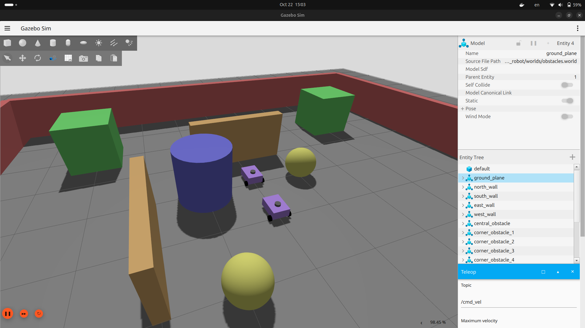
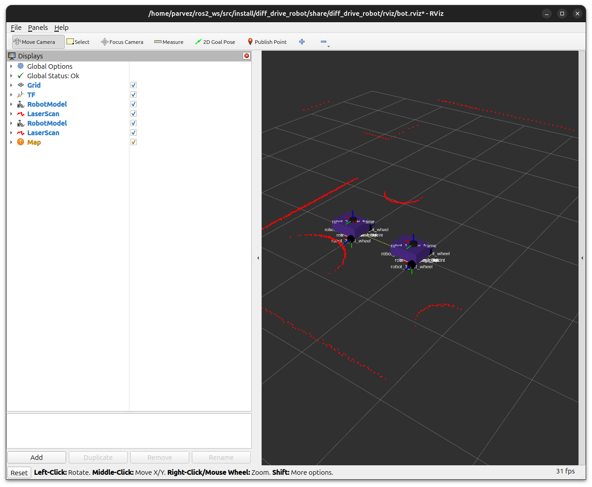

# Diff Drive Robot Simulation - Author: Mohamed Parvez Aslam

A ROS 2 simulation package for differential drive robots using ROS 2 Jazzy and Gazebo Harmonic.

Lastest update: Mapping

**Package is still under development**

## Features

- Differential drive robot with LiDAR and IMU sensor
- Gazebo Harmonic Simulation
- Tele-operation control
- RViz2 visualization
- Modular URDF with xacro

## Requirements

- Ubuntu 24.04
- ROS 2 Jazzy
- Gazebo Harmonic

## Installation

```bash
sudo apt install -y \
    ros-jazzy-ros-gz \
    ros-jazzy-ros-gz-bridge \
    ros-jazzy-joint-state-publisher \
    ros-jazzy-xacro \
    ros-jazzy-teleop-twist-keyboard \
    ros-jazzy-teleop-twist-joy \
    ros-jazzy-cartographer \
```

## Setup

```bash
mkdir -p ros2_ws/src
cd ros2_ws/src
git clone -b multi-robot https://github.com/CyberParvez/diff_drive_robot.git
cd ..
colcon build --packages-select diff_drive_robot --symlink-install
```

## Functionalities

### Launch Robot

```bash
source install/setup.bash
ros2 launch diff_drive_robot robot.launch.py 
```

### Robot Control

```bash
ros2 run teleop_twist_keyboard teleop_twist_keyboard 
```

## Demo


